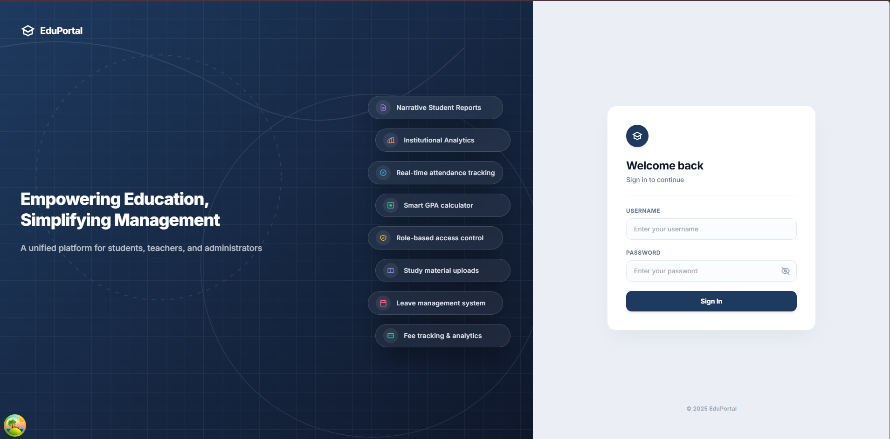
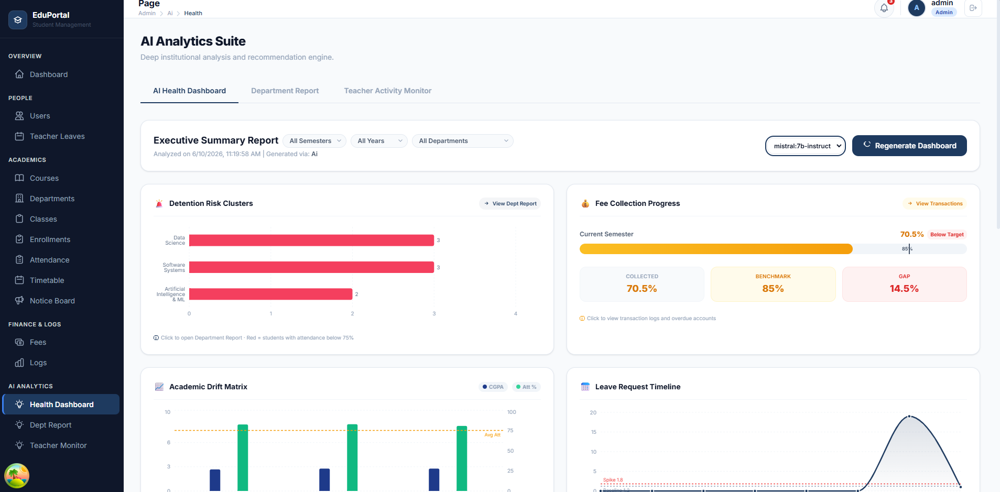

#  College Student Management System

A production-ready educational platform that connects students, teachers, and administrators to simplify college operations. Built with FastAPI, PostgreSQL, JWT authentication, React (Vite), and Docker.

---

##  Screenshots

|  Home Page Dashboard |  AI Reports & Performance Narrative |
| :---: | :---: |
|  |  |

---

##  Key Features

*   **Role-Based Access Control**: Customized dashboards and workflows for Admins, Teachers, and Students.
*   **Core Academic Infrastructure**: Management of departments, courses, classes, notice boards, and student enrollments.
*   **Timetables**: Weekly schedules with interval-overlap clash detection.
*   **Grades & Financials**: Live calculation of SGPA/CGPA (10-point scale), fee billing tracking, and automated receipt PDF generation.
*   **Leave Request Portals**: Structured workflows for student leave (reviewed by teachers with balance checks) and teacher leave (reviewed by admins).
*   **Resource Repository**: File storage database referencing course study materials (PDF, DOCX, MP4, images).
*   **AI-Powered Diagnostics**: Auto-generated student performance progress narratives, college-wide institutional health reports (with Q&A chat), and automated teacher compliance activity flags.

---

##  Tech Stack

### Backend

| Technology | Purpose |
| :--- | :--- |
| **FastAPI** (0.111.0) | Async Python web framework |
| **PostgreSQL** (Latest) | Primary relational database |
| **SQLAlchemy** (2.0 with asyncpg driver) | Type-safe async ORM |
| **Alembic** (1.13.1) | Database migration management |
| **OpenWebUI API** (httpx async client) | LLM / AI integration layer |
| **ReportLab** (4.5.1) | Dynamic PDF generation |
| **python-jose + passlib** (bcrypt) | JWT auth & password hashing |
| **Pydantic v2** (pydantic-settings) | Data validation & env config |
| **slowapi** (100 req/min IP bucket) | Rate limiting middleware |
| **fastapi-cache2** (InMemoryBackend) | Response caching |
| **Docker & Docker Compose** (—) | Containerized deployment |

### Frontend

| Technology | Purpose |
| :--- | :--- |
| **React 18** (Vite build system) | Core UI library |
| **Tailwind CSS v3** (Utility classes only) | Styling framework |
| **React Router v6** (—) | Client-side routing |
| **TanStack React Query v5** (With DevTools) | Server state & data fetching |
| **Axios** (JWT Bearer interceptor) | HTTP client with auto 401 redirect |
| **React Hook Form** (—) | Form state management |
| **Recharts** (—) | Analytics charts & trend graphs |
| **react-hot-toast** (—) | Real-time success/error notifications |

---

##  Roles & Access Control

###  Admin
*   **System Administration**: Full system access, including creating and deactivating users, and bulk importing users from CSV.
*   **Academic Setup**: CRUD operations on departments, courses, classes, and student enrollments.
*   **Student Profile Management**: Create and manage student profiles.
*   **Leave Management**: Review, approve, or reject teacher leave requests; list and delete leave requests.
*   **Fee Management**: Create, update, delete, pay fees, and export receipt PDFs.
*   **AI Analytics & Reporting**: Generate and view institutional health reports (with chat Q&A), department comparison reports (with PDF export), teacher compliance activity logs, and approve/bulk-approve AI student reports.
*   **Dashboard**: Access the admin analytics dashboard.

###  Teacher
*   **Academic Management**: View student lists in assigned classes, mark attendance (single or bulk), and input/manage student grades.
*   **Study Materials**: Upload study materials for courses, view uploaded materials, and delete materials they authored.
*   **Leave Management**: Submit personal leave requests (reviewed by admins); review, approve, or reject student leave requests assigned to them.
*   **Profile & Documents**: View and update teacher-specific profile (personal details, signature, bank credentials, photo) and upload/manage teacher documents.
*   **Notice Board**: Post announcements for classes or target roles.
*   **Dashboard & Reports**: Access the teacher dashboard and view/generate AI student reports.

###  Student
*   **Personal Academic Views**: View own grades, GPA/CGPA calculations, attendance, and weekly timetables.
*   **Tools**: Access GPA What-If Simulator and CGPA Predictor.
*   **Leave Management**: Submit leave requests (reviewed by assigned teachers), check current semester leave balance, and withdraw/delete pending requests.
*   **Fee Obligation**: View personal fees and billing status.
*   **Resources**: View notice board announcements and download study materials for enrolled courses.
*   **Profile & Documents**: View and update student-specific profile (contact info, address, parent details, photo, signature) and manage student documents.
*   **Dashboard**: Access student dashboard analytics.

---

##  AI Powered Features

1.  **AI Student Progress & Narrative Reports**
    *   **Context Gathering**: Gathers individual student data including overall and subject-wise attendance (specifically tracking core courses like *Neural Networks & DL*, *Machine Learning Fundamentals*, and *Computer Vision*), current CGPA, course grades, historical CGPA trends, and leave records.
    *   **Advisor Simulation**: The LLM acts as an academic advisor to analyze performance indicators and flag critical risks (such as a drop in class attendance or CGPA declines).
    *   **Core Risk & Advice Synthesis**: Identifies the primary roadblocks the student faces ("Core Risk") and outlines clear, next-step recommendations for faculty advisors ("Advice").
    *   **Review & Approval Workflow**: Reports are generated as editable drafts. Teachers can append custom remarks, and Admins can review and approve them (individually or in bulk) to freeze the narrative.
    *   **Official Export**: Once approved, the narrative and academic status tables are formatted and exported as professional signed PDFs.

2.  **Institutional Health Reports**
    *   **Metrics Synthesis**: Consolidates campus-wide metrics including total students/teachers, average CGPA, overall attendance rates, fee collection percentages, leave request statistics, and pending leave backlog.
    *   **Automated KPI Extraction**: Evaluates compliance thresholds and generates structured alerts for events like *Attendance Crises*, *Detention Risks*, *Fee Collection Gaps*, or *Leave Spikes*.
    *   **Executive Summary Generation**: Uses the LLM to write a comprehensive executive narrative outlining institutional strengths, weaknesses, department academic/attendance drifts, and structural administrative recommendations.
    *   **Visualization Datasets**: Pre-calculates datasets to feed interactive charts, including horizontal bar charts for detention risks by department, grouped bar charts for academic drift matrices, fee collection gauges, and area charts for leave spikes.

3.  **Conversational Health Q&A Chat**
    *   **Context-Aware Analytics**: Feeds the latest institutional health report narrative directly into the LLM context.
    *   **Natural Language Querying**: Allows Admins to ask questions about the institutional data (e.g., querying specific anomalies, drilling down into department metrics, or asking for academic planning advice) without re-running heavy database queries.
    *   **Dynamic Response Generation**: Returns concise, conversational answers based on the generated institutional report state.

4.  **Teacher Compliance & Activity Monitoring**
    *   **Completeness Evaluation**: Tracks teacher activity across five key operational compliance indicators: grades entered, study materials uploaded, leave request reviews, notice postings, and scheduled attendance markings.
    *   **Automated Flagging & Compliance Severity**: Flags any missing or delayed tasks with status levels (`ok`, `warning`, `critical`).
    *   **AI Remediation Recommendations**: For non-compliant teachers, the LLM analyzes their specific missing tasks (such as unentered grades or overdue leaves) and generates a structured array of actionable compliance flags containing warning levels and detailed feedback messages.

---

##  Database Schema (20 tables)

*   `ai_health_reports`: `id, generated_at, semester, academic_year, content, flags, generated_by`
*   `ai_reports`: `id, student_id, teacher_id, semester, academic_year, narrative, edited_narrative, risk_flags, status, current_cgpa, overall_attendance, created_at, approved_at`
*   `attendance`: `id, student_id, course_id, class_id, date, status, marked_by, created_at`
*   `classes`: `id, name, department_id, year, semester`
*   `courses`: `id, name, code, department_id, credits, semester`
*   `departments`: `id, name, code`
*   `enrollment`: `id, student_id, class_id`
*   `fees`: `id, student_id, amount, fee_type, status, due_date, paid_date, created_at`
*   `grades`: `id, student_id, course_id, marks, grade, semester, academic_year, created_at`
*   `leave_requests`: `id, student_id, teacher_id, reason, from_date, to_date, status, created_at`
*   `notice_board`: `id, author_id, title, content, target_role, class_id, created_at`
*   `roles`: `id, name`
*   `student_documents`: `id, student_id, doc_type, file_name, file_path, uploaded_at`
*   `student_profile`: `id, user_id, department_id, class_id, roll_number, dob, blood_group, phone, address, emergency_contact, profile_photo, first_name, last_name, gender, nationality, state, year_of_study, batch_year, admission_date, hostel_status, personal_email, current_address, permanent_address, parent_name, parent_relationship, parent_phone, emergency_contact_name, emergency_contact_rel, emergency_contact_phone, signature, profile_completed_pct, last_edited_at`
*   `study_materials`: `id, teacher_id, course_id, title, description, file_path, file_type, file_size, created_at`
*   `teacher_documents`: `id, teacher_id, doc_type, file_name, file_path, uploaded_at`
*   `teacher_leave_requests`: `id, teacher_id, admin_id, reason, from_date, to_date, status, created_at`
*   `teacher_profile`: `id, user_id, department_id, full_name, gender, date_of_birth, employee_id, designation, employment_type, highest_qualification, phone, alternate_phone, profile_photo, signature, personal_email, current_address, permanent_address, emergency_contact_name, emergency_contact_rel, emergency_contact_phone, bank_name, account_number, ifsc_code, profile_completed_pct, last_edited_at`
*   `timetable`: `id, class_id, course_id, teacher_id, day, start_time, end_time, room`
*   `users`: `id, username, email, password_hash, role_id, is_active, created_at`

---

##  Security, Rate Limiting & Caching

### Rate Limiting
*   **Limit**: Maximum `100 requests per minute` per client IP.
*   Excess requests receive a `429 Too Many Requests` status code with a JSON detail payload.

### Request Logging
*   Custom ASGI request interceptor logs all methods, paths, status codes, and latencies.
*   Example log: `2026-05-26 16:40:00 [INFO] Method: GET | Path: /dashboard/admin | Status: 200 | Time: 0.0240s`
*   Logs are written to stdout and a rolling file at `logs/app.log`.

### Caching Rules
The application uses an in-memory cache backend to reduce latency on relatively static GET endpoints:
*   **Timetable (`/timetable/class/{id}`, `/timetable/me`)**: `3600 seconds` (1 hour)
*   **Notice Board (`/notice`)**: `1800 seconds` (30 minutes)
*   **Departments & Courses (`/departments`, `/courses`)**: `7200 seconds` (2 hours)

---

##  Dashboard Metrics API

### Admin Dashboard (`GET /dashboard/admin`)
*   Total active students and teachers counts
*   Total fees collected (paid) and pending fees sums
*   Pending student leave requests count
*   Total study materials count

### Teacher Dashboard (`GET /dashboard/teacher`)
*   Assigned classes count (unique classes from timetable slots)
*   Pending leave requests assigned to the teacher
*   Today's attendance records marked by the teacher
*   Total study materials uploaded by the teacher

### Student Dashboard (`GET /dashboard/student`)
*   Attendance percentage per course (present/late counts as present)
*   Pending/overdue fees total
*   Current GPA (4.0 scale)
*   Today's timetable slots sorted by start time

---

##  All API Endpoints

<details>
<summary> Auth Endpoints</summary>

*   `POST /auth/login` - Login and obtain JWT access token
*   `GET /auth/me` - Get current authenticated user
</details>

<details>
<summary> Users Endpoints (Admin only)</summary>

*   `POST /users` - Create a new user
*   `GET /users` - List all users (paginated with filters)
*   `GET /users/{user_id}` - Get a single user by ID
*   `PUT /users/{user_id}` - Update a user
*   `DELETE /users/{user_id}` - Deactivate a user (soft delete)
*   `POST /users/import` - Bulk import users (students/teachers) from CSV file
</details>

<details>
<summary> Academic Setup (Departments, Courses & Classes)</summary>

*   `POST /departments` - Create a department (Admin only)
*   `GET /departments` - List all departments (Any authenticated user)
*   `GET /departments/{dept_id}` - Get a department by ID (Any authenticated user)
*   `PUT /departments/{dept_id}` - Update a department (Admin only)
*   `DELETE /departments/{dept_id}` - Delete a department (Admin only)
*   `POST /courses` - Create a course (Admin only)
*   `GET /courses` - List courses, optionally filter by department (Any authenticated user)
*   `GET /courses/{course_id}` - Get a course by ID (Any authenticated user)
*   `PUT /courses/{course_id}` - Update a course (Admin only)
*   `DELETE /courses/{course_id}` - Delete a course (Admin only)
*   `POST /classes` - Create a class (Admin only)
*   `GET /classes` - List classes, optionally filter by department (Any authenticated user)
*   `GET /classes/{class_id}` - Get a class by ID (Any authenticated user)
*   `PUT /classes/{class_id}` - Update a class (Admin only)
*   `DELETE /classes/{class_id}` - Delete a class (Admin only)
</details>

<details>
<summary> Profile & Enrollment Endpoints</summary>

*   `POST /profile` - Admin creates a student profile
*   `GET /profile/me` - Student views their own profile
*   `PUT /profile/me` - Student updates their own profile
*   `GET /profile/{user_id}` - Admin or teacher views any student's profile
*   `POST /enrollment` - Admin enrolls a student in a class
*   `GET /enrollment/class/{class_id}` - Teacher or admin views all students in a class
*   `GET /enrollment/class/{class_id}/students` - Teacher gets slim student list for a class
*   `DELETE /enrollment/{enrollment_id}` - Admin removes a student enrollment
</details>

<details>
<summary> Teacher-specific Profile Endpoints</summary>

*   `GET /profile/teacher/me` - Teacher views their own profile
*   `PUT /profile/teacher/me` - Teacher updates their own profile
*   `POST /profile/teacher/me/photo` - Teacher uploads their profile photo
*   `POST /profile/teacher/me/signature` - Teacher uploads their signature
*   `POST /profile/teacher/me/documents` - Teacher uploads a document
*   `GET /profile/teacher/me/documents` - Teacher lists their own documents
*   `DELETE /profile/teacher/me/documents/{doc_id}` - Teacher deletes their own document
</details>

<details>
<summary> Student-specific Profile Endpoints</summary>

*   `GET /profile/student/me` - Student views their own profile
*   `PUT /profile/student/me` - Student updates their own profile
*   `POST /profile/student/me/photo` - Student uploads their profile photo
*   `POST /profile/student/me/signature` - Student uploads their signature
*   `POST /profile/student/me/documents` - Student uploads a document
*   `GET /profile/student/me/documents` - Student lists their own documents
*   `DELETE /profile/student/me/documents/{doc_id}` - Student deletes their own document
</details>

<details>
<summary> Attendance Endpoints</summary>

*   `POST /attendance` - Teacher marks attendance for a student
*   `POST /attendance/bulk` - Mark attendance for multiple students at once
*   `GET /attendance/{id}` - Get full attendance record
*   `PUT /attendance/{id}` - Update an existing attendance record
*   `DELETE /attendance/{id}` - Delete an attendance record
</details>

<details>
<summary> Study Materials</summary>

*   `POST /material` - Upload study material (multipart form)
*   `GET /material/course/{course_id}` - Get all study materials for a course
*   `GET /material/me` - Get materials uploaded by current teacher
*   `GET /material/{material_id}` - Download or view a specific study material file
*   `DELETE /material/{material_id}` - Delete a study material (author or admin only)
</details>

<details>
<summary> AI Reports & Progress Narratives</summary>

*   `POST /ai/reports/generate` - Generate Reports
*   `GET /ai/reports/student/{student_id}` - Get Student Reports
*   `GET /ai/reports/class/{class_id}` - Get Class Reports
*   `GET /ai/reports/me` - Get My Reports
*   `PUT /ai/reports/{report_id}/approve` - Approve Report
*   `POST /ai/reports/bulk-approve` - Bulk Approve Reports
*   `DELETE /ai/reports/{report_id}` - Delete Report
*   `GET /ai/reports/{report_id}/pdf` - Download Report Pdf
</details>

<details>
<summary> Leave Management (Student & Teacher)</summary>

*   `POST /teacher/leave` - Submit a new teacher leave request (Teacher only)
*   `GET /teacher/leave` - List all teacher leave requests (Admin only)
*   `GET /teacher/leave/me` - Get my leave requests (Teacher or Admin)
*   `GET /teacher/leave/{leave_id}` - Get details of a specific teacher leave request
*   `DELETE /teacher/leave/{leave_id}` - Delete or withdraw a teacher leave request
*   `POST /teacher/leave/{leave_id}/review` - Approve or reject a teacher leave request (Admin only)
</details>

<details>
<summary> AI Admin Analytics</summary>

*   `GET /ai/admin/health/semesters` - List all available semester/year options
*   `GET /ai/admin/health` - Get institutional health report
*   `POST /ai/admin/health/generate` - Force-regenerate the institutional health report
*   `POST /ai/admin/health/chat` - Chat Q&A over the health report
*   `GET /ai/admin/departments/report` - Department comparison analytics
*   `GET /ai/admin/departments/report/pdf` - Export department report as PDF
*   `GET /ai/admin/teachers/activity` - Per-teacher compliance activity with AI flags
</details>

---

##  Installation & Run Guide

### Prerequisite
Ensure Docker and Docker Compose (or Python 3.11+ and Node.js) are installed.

### Option A: Running with Docker Compose (Recommended)

1.  **Configure Environment**: Copy `.env.example` to `.env` and configure your settings:
    ```bash
    cp .env.example .env
    ```
2.  **Launch Services**: Build and start PostgreSQL, FastAPI, and React Frontend in containers:
    ```bash
    docker-compose up --build
    ```
    *Note: Database tables are auto-created and seeded with mock data on startup.*
3.  **Default Seed Credentials**:
    *   **Role**: Admin
    *   **Username**: `admin`
    *   **Password**: `admin123`

### Option B: Local Manual Setup

#### 1. Backend (FastAPI)
1.  **Create and Activate Virtual Environment**:
    ```bash
    python -m venv venv
    # Windows (PowerShell):
    .\venv\Scripts\Activate.ps1
    # Windows (CMD):
    .\venv\Scripts\activate.bat
    # Linux/macOS:
    source venv/bin/activate
    ```
2.  **Install Dependencies**:
    ```bash
    pip install -r requirements.txt
    ```
3.  **Run Application**:
    ```bash
    uvicorn main:app --reload --port 8000
    ```

#### 2. Frontend (React + Vite)
1.  **Navigate and Install Dependencies**:
    ```bash
    cd frontend
    npm install
    ```
2.  **Run Development Server**:
    ```bash
    npm run dev
    ```
    The frontend will run on http://localhost:5173 (or another available port shown in console).
